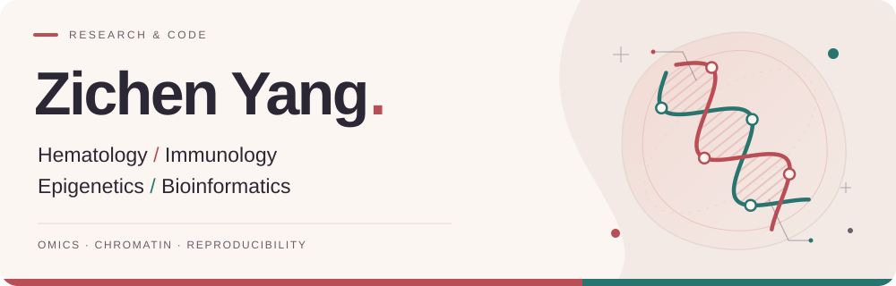

<picture>
  <source media="(prefers-color-scheme: dark)" srcset="assets/hero-dark.svg">
  <source media="(prefers-color-scheme: light)" srcset="assets/hero-light.svg">
  
</picture>

  

  I build reproducible tools and workflows for omics analysis, 
  with a focus on epigenomics, transcriptomics, and chromatin interactions.

  
  
  
  
  

 

### Selected work

> **[HelixWeave ↗](https://github.com/ZichenYang-glitch/ENCODE-style-ChIPseq-CUT-Tag-pipeline)** 
> OMICS WORKFLOW PLATFORM
>
> A local platform for running omics workflows and reviewing quality control and results.

> **[RNA-seq Downstream Toolkit ↗](https://github.com/ZichenYang-glitch/rnaseq-downstream)** 
> BULK RNA-SEQ · RESEARCH PREVIEW
>
> Auditable input validation and differential expression analysis for bulk RNA-seq.

 

### 🐍 Contribution snake

<picture>
  <source media="(prefers-color-scheme: dark)" srcset="https://raw.githubusercontent.com/ZichenYang-glitch/ZichenYang-glitch/output/github-contribution-grid-snake-dark.svg">
  <source media="(prefers-color-scheme: light)" srcset="https://raw.githubusercontent.com/ZichenYang-glitch/ZichenYang-glitch/output/github-contribution-grid-snake.svg">
  
</picture>

Updated daily · Powered by <a href="https://github.com/Platane/snk">Platane/snk</a>

---

<em>Drifting like duckweed, yet destined to meet again.</em>

